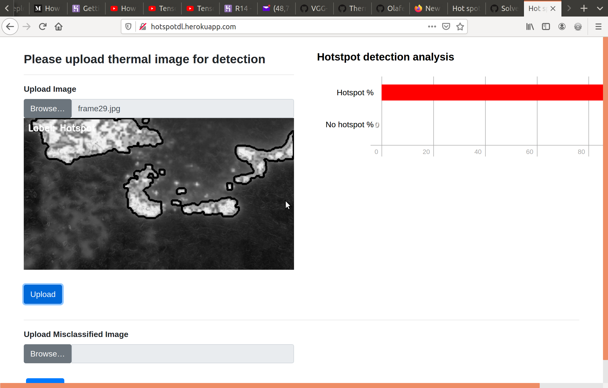
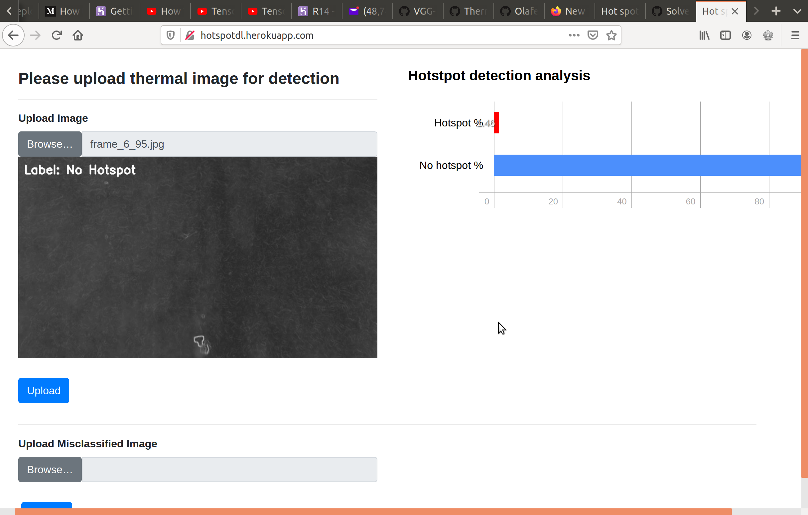

# Automated-detection-of-hotspot-in-thermal-images
A  CNN network trained for detecting hotspot in thermal imagery via transfer learning.
The binary detection method determines whether thermal images contains hotspots or not. 
A pre trained VGG16 keras model is used to extract arbitary feature vectors that globally describe the image. Based on the extracted features, a Logistic Regression classifier is trained on the features for image classification purposes. For images that contain hotspot, the hotspot regions are localised using Otsus's adaptive thresholding techniques. See link below for demonstration <br/>
http://hotspotdl.herokuapp.com/


## Install via pip
### Fix opencv dependency issue when installing with pip on debian system
``` bash
apt-get install -y libsm6 libxext6 libxrender-dev
```
### Fix - add dependencies for opengl
``` bash
sudo apt-get install -y libgirepository1.0-dev build-essential \
  libbz2-dev libreadline-dev libssl-dev zlib1g-dev libsqlite3-dev wget \
  curl llvm libncurses5-dev libncursesw5-dev xz-utils tk-dev libcairo2-dev
```
Software has been developed in Python. Install dependencies using pip
``` bash
pip install -r requirements.txt
```
## Install - Using Docker
Build docker image
``` bash
docker build -t <name of image > .
```
Run docker container 
``` bash
docker run -it -p 5000:5000 <name of image > 
```
## Instructions on using the VGG16 model for extracting features from training and testing data.

```bash
python feature_extraction.py [-h] -i IMAGES -o OUTPUT
optional arguments:
-h --help show this help message and exit
-i IMAGES, --images IMAGES path to input images
-o OUTPUT, --output OUTPATH path to output hdf5 file
```
### Example - Extracting features from training images
  ```python feature_extraction.py -i ../training_test_data/training/ -o features_training.hdf5```
  
### Example - Extracting features from testing images
   ```python feature_extraction.py -i ../training_test_data/testing/ -o features_testing.hdf5 ```

Once the features have been extracted, a Logistric Regression model can be trained on the extracted features

```bash
python classifier.py [-h] -train TRAIN_HDF5 -test TEST_HDF5
optional arguments:
-h --help show this help message and exit
-train TRAIN_HDF5, --train_hdf5 TRAIN_HDF5 path to trained hdf5 file
-test TEST_HDF5, --test TEST_HDF5 path to test hdf5 file
```
### Example - Training a classifier on the extracted features
  ```python classifier.py -train features_training.hdf5 -test features.hdf5``` <br/>
  
  Output from the python script would be a `model.cpickle` file
  
  
 ## Running the flask app  to perform hot spot detection.
 
 Run the following commands to create your apps database tables and perform initial migration
 ```bash
flask db init
flask db migrate
flask db upgrade
```
To run the web application use:
```bash
python app.py
```
A web server would be spawend and one can type in the browser `localhost:5000` and you should see:
# 

## Input image-  thermal image with hotspots in image
# 

## Input image - thermal image with no hotspots in image
# 


